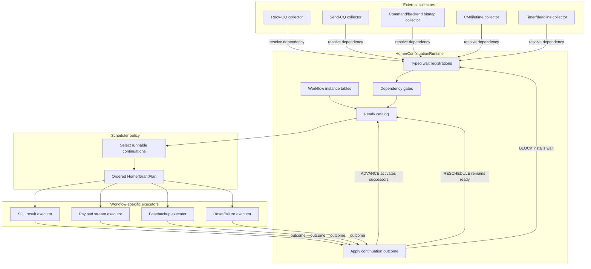
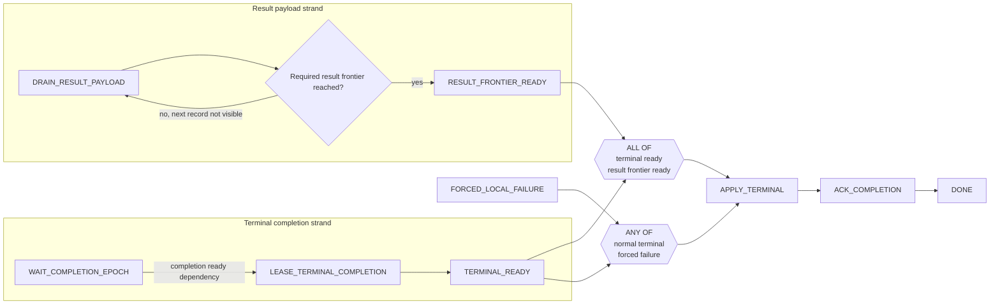
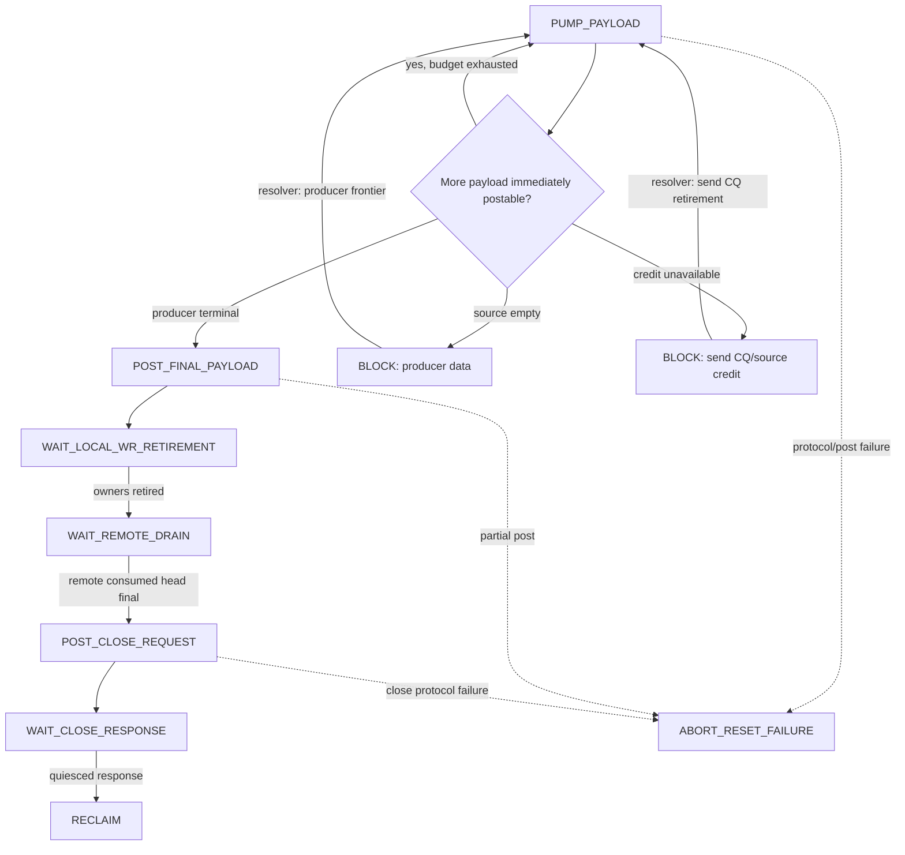
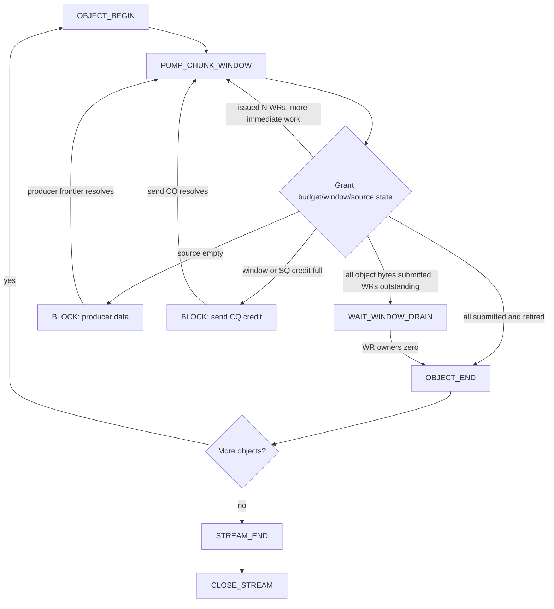

# Homer Continuation Graph Scheduler Plan

## Scope

- **What this doc explains**: the proposed continuation-graph scheduler model for Homer service work after the Slice 4B scheduler-priority hang. It defines the top-level objects, the boundary between workflow logic and scheduling policy, dependency/gate handling, ready-catalog semantics, and a staged migration path from the current guarded-action scheduler.
- **What this doc does not cover**: DPU offload, multi-threaded service execution, a generic workflow DSL, or replacing the RDMA transport ownership fixes already landed in the v27 recovery work.
- **Primary directory**: `docs/kb/future-directions/citus/transport/`
- **Doc type**: `future-direction`

This plan complements [`homer_completion_publication_v27_recovery_plan.md`](homer_completion_publication_v27_recovery_plan.md). The v27 recovery work fixed publication, CQ ownership, reset, close, and failure-lifetime contracts. This plan addresses the remaining scheduler modeling issue: the current machine/action-mask scheduler can expose several semantically dependent action bits and then asks a global planner to infer the safe order.

## Motivation

The Slice 4B hang showed the failure mode directly:

```text
machine exposes PAYLOAD_PROGRESS and PAYLOAD_CLOSE_RECLAIM
scheduler bands prioritize or exclude based on action bits
close/reclaim can be selected before payload progress it depends on
terminal completion remains blocked on result payload
frontend waits indefinitely
```

The design error is not that Homer uses state machines. The error is that one state-machine owner can expose multiple ready actions whose causal relationship is implicit and policy-dependent.

The new rule is:

```text
Workflow owns causal sequencing.
Scheduler owns resource allocation and grant order among already-runnable continuations.
```

A workflow may have several active strands. Each strand has one current continuation. Multiple continuations may be active concurrently when they are genuinely independent or pipelined. A downstream continuation becomes ready through explicit dependency resolution or a gate, not because the scheduler guessed a priority ordering.

## Top-level objects

| Object | Responsibility |
|---|---|
| `HomerWorkflowDefinition` | Immutable, statically declared continuation graph for one workload kind. |
| `HomerWorkflowInstance` | Dynamic state for one command/result/backup/stream execution. Existing state-machine fields move here as domain state. |
| `HomerContinuationDefinition` | One static node in the workflow graph and its action implementation identity. |
| `HomerContinuationInstance` | Runtime state of one node in one workflow instance. |
| `HomerDependencySpec` | One parameterized condition that can block a continuation. |
| `HomerDependencyGate` | Composition of dependencies, such as all-of and any-of joins. |
| `HomerContinuationRuntime` | Service-embedded subsystem that owns continuation state transitions, ready-catalog membership, wait registration, gate satisfaction, grant claiming, and outcome application. |
| `HomerReadyCatalog` | Durable set of runnable continuation references. It is not the ordered grant list. |
| `HomerSchedulerPolicy` | Policy that selects an ordered grant list from the ready catalog under budgets and priorities. |
| `HomerGrantPlan` | Ephemeral ordered list selected for one service pass or scheduling decision. |

## What is the runtime?

`HomerContinuationRuntime` is not a new thread and not the whole service loop. It is a conceptual and code-level subsystem embedded in the Homer service state.

It owns:

```text
workflow registry / fixed workflow instance tables
continuation state transitions
ready catalog insertion/removal
claiming selected grants
rollback of unexecuted grants
wait registration helpers
gate satisfaction helpers
outcome application
stale generation validation
```

The service loop calls into it:

```text
collect external events
    -> dependency resolvers update runtime/gates/ready catalog
scheduler policy builds grant plan from ready catalog
    -> runtime claims grants
executor dispatches grants to workflow-specific code
    -> workflow executor returns outcome
runtime applies outcome
```

Workflow-specific code executes semantic work and updates domain state. It does not directly mutate ready-catalog membership.

## Static workflow definition

The implementation should be fixed C structures, enums, and switch dispatch. Do not build a heap-allocated generic workflow engine or DSL.

```c
typedef uint16_t HomerContinuationNodeId;
typedef uint16_t HomerDependencyGateId;

typedef enum HomerWorkflowKind
{
    HOMER_WORKFLOW_FRONTEND_COMMAND = 1,
    HOMER_WORKFLOW_BACKEND_COMMAND,
    HOMER_WORKFLOW_SQL_RESULT,
    HOMER_WORKFLOW_BASEBACKUP_STREAM,
    HOMER_WORKFLOW_PAYLOAD_STREAM,
    HOMER_WORKFLOW_PAYLOAD_CLOSE,
    HOMER_WORKFLOW_CONNECTION_RESET
} HomerWorkflowKind;

typedef struct HomerContinuationDefinition
{
    HomerContinuationNodeId nodeId;
    uint16_t strandId;

    HomerContinuationKind continuationKind;
    HomerSchedulingClass defaultSchedulingClass;

    /* Static switch-dispatched implementation identity. */
    HomerActionKind actionKind;

    const HomerContinuationNodeId *successors;
    uint16_t successorCount;

    HomerDependencyGateId completionGate;
} HomerContinuationDefinition;

typedef struct HomerWorkflowDefinition
{
    HomerWorkflowKind kind;

    const HomerContinuationDefinition *nodes;
    uint16_t nodeCount;

    const HomerDependencyGateDefinition *gates;
    uint16_t gateCount;

    uint16_t maxActiveStrands;
} HomerWorkflowDefinition;
```

Examples:

```c
extern const HomerWorkflowDefinition HomerSqlResultWorkflowDefinition;
extern const HomerWorkflowDefinition HomerPayloadStreamWorkflowDefinition;
extern const HomerWorkflowDefinition HomerBaseBackupWorkflowDefinition;
```

## Dynamic workflow instance

```c
typedef struct HomerWorkflowRef
{
    HomerWorkflowKind kind;
    uint32_t index;
    uint64_t generation;
} HomerWorkflowRef;

typedef struct HomerContinuationRef
{
    HomerWorkflowRef workflow;
    HomerContinuationNodeId nodeId;
    uint64_t activationGeneration;
} HomerContinuationRef;

typedef enum HomerContinuationState
{
    HOMER_CONTINUATION_DORMANT = 0,
    HOMER_CONTINUATION_READY,
    HOMER_CONTINUATION_CLAIMED,
    HOMER_CONTINUATION_RUNNING,
    HOMER_CONTINUATION_WAITING,
    HOMER_CONTINUATION_DONE,
    HOMER_CONTINUATION_CANCELLED
} HomerContinuationState;

typedef struct HomerContinuationInstance
{
    HomerContinuationRef ref;
    HomerContinuationState state;

    HomerSchedulingClass schedulingClass;

    HomerWaitRegistration waitRegistration;

    uint64_t readySinceServicePass;
    uint64_t lastGrantedServicePass;

    bool readyCatalogMember;
} HomerContinuationInstance;

typedef struct HomerWorkflowInstance
{
    const HomerWorkflowDefinition *definition;
    HomerWorkflowRef ref;

    HomerWorkflowState state;

    HomerContinuationInstance continuations[
        HOMER_MAX_CONTINUATIONS_PER_WORKFLOW];

    HomerDependencyGateInstance gates[
        HOMER_MAX_GATES_PER_WORKFLOW];

    union
    {
        HomerSqlResultWorkflowState sqlResult;
        HomerBaseBackupWorkflowState baseBackup;
        HomerPayloadWorkflowState payload;
        HomerCommandWorkflowState command;
    } data;
} HomerWorkflowInstance;
```

## Active frontier

A workflow frontier contains zero or more active continuations.

```text
for each sequential strand:
    at most one active continuation

for one workflow:
    several strands may be active concurrently
```

Examples:

```text
SQL result workflow:
    WAIT_TERMINAL_EVENT strand
    DRAIN_RESULT_PAYLOAD strand
    all-of join to APPLY_TERMINAL

Basebackup workflow:
    PUMP_CHUNK_WINDOW continuation
    physical WR owners are not scheduler continuations

Payload stream workflow:
    PUMP_PAYLOAD -> POST_FINAL -> WAIT_RETIREMENT -> WAIT_REMOTE_DRAIN -> CLOSE -> RECLAIM
```

## Mermaid: high-level runtime/scheduler loop



## Grant execution and outcome application

A scheduler grant is selected from the ready catalog and then claimed.

```c
typedef struct HomerContinuationBudget
{
    uint32_t maxRecords;
    uint64_t maxBytes;
    uint32_t maxWrs;
    uint32_t maxCqPollBatches;
} HomerContinuationBudget;

typedef struct HomerContinuationGrant
{
    HomerContinuationRef continuation;
    HomerContinuationBudget budget;
    HomerSchedulingClass schedulingClass;
    uint64_t schedulerDecisionEpoch;
} HomerContinuationGrant;
```

The grant dispatcher resolves the workflow and calls a static executor:

```c
static HomerContinuationOutcome
HomerExecuteContinuationGrant(
    HomerContinuationRuntime *runtime,
    const HomerContinuationGrant *grant)
{
    HomerWorkflowInstance *workflow;
    HomerContinuationInstance *continuation;

    workflow = HomerResolveWorkflow(runtime, grant->continuation.workflow);
    continuation = HomerResolveContinuation(workflow, grant->continuation);

    if (continuation == NULL ||
        continuation->state != HOMER_CONTINUATION_CLAIMED)
    {
        return HomerStaleContinuationOutcome();
    }

    continuation->state = HOMER_CONTINUATION_RUNNING;

    switch (workflow->definition->kind)
    {
        case HOMER_WORKFLOW_SQL_RESULT:
            return HomerExecuteSqlResultContinuation(
                workflow, continuation, &grant->budget);

        case HOMER_WORKFLOW_BASEBACKUP_STREAM:
            return HomerExecuteBaseBackupContinuation(
                workflow, continuation, &grant->budget);

        case HOMER_WORKFLOW_PAYLOAD_STREAM:
        case HOMER_WORKFLOW_PAYLOAD_CLOSE:
            return HomerExecutePayloadContinuation(
                workflow, continuation, &grant->budget);

        case HOMER_WORKFLOW_CONNECTION_RESET:
            return HomerExecuteResetContinuation(
                workflow, continuation, &grant->budget);

        default:
            return HomerInvalidContinuationOutcome();
    }
}
```

The runtime applies the returned outcome:

```c
HomerApplyContinuationOutcome(runtime, grant->continuation, &outcome);
```

## Continuation outcome

```c
typedef enum HomerContinuationDisposition
{
    HOMER_CONTINUATION_ADVANCE = 0,
    HOMER_CONTINUATION_BLOCK,
    HOMER_CONTINUATION_RESCHEDULE,
    HOMER_CONTINUATION_COMPLETE,
    HOMER_CONTINUATION_FAIL
} HomerContinuationDisposition;

typedef struct HomerContinuationProgress
{
    uint32_t recordsProcessed;
    uint64_t bytesProcessed;
    uint32_t wrsPosted;
    uint32_t cqesProcessed;
} HomerContinuationProgress;

typedef struct HomerContinuationOutcome
{
    HomerContinuationDisposition disposition;
    HomerContinuationProgress progress;

    union
    {
        struct
        {
            HomerTransitionCode transitionCode;
        } advance;

        struct
        {
            HomerDependencySpec dependency;
        } block;

        struct
        {
            HomerWorkflowFailureCode failureCode;
        } fail;
    } data;
} HomerContinuationOutcome;
```

Semantics:

```text
ADVANCE:
    current step completed; activate successors or satisfy joins.

BLOCK:
    current continuation remains active but becomes WAITING on a typed dependency.

RESCHEDULE:
    continuation made useful progress and remains immediately runnable.

COMPLETE:
    strand or workflow finished.

FAIL:
    transition to typed failure/reset continuation and cancel incompatible siblings.
```

`RESCHEDULE` must report useful progress:

```c
Assert(outcome.progress.recordsProcessed > 0 ||
       outcome.progress.bytesProcessed > 0 ||
       outcome.progress.wrsPosted > 0 ||
       outcome.progress.cqesProcessed > 0);
```

If no useful progress occurred, the continuation must return `BLOCK` with an explicit dependency.

## Ready catalog versus grant list

The current ordered grant list remains useful. It is the scheduler's output for one service pass.

A new ready catalog is durable across service passes. It records which continuation instances are runnable. It should have set semantics, not necessarily FIFO semantics.

```c
typedef struct HomerReadyMetadata
{
    bool present;
    HomerSchedulingClass schedulingClass;
    uint64_t readySinceServicePass;
    uint64_t lastGrantedServicePass;
    uint32_t estimatedCost;
} HomerReadyMetadata;

typedef struct HomerReadyCatalog
{
    uint64_t readyBits[HOMER_SCHEDULING_CLASS_COUNT]
                      [HOMER_CONTINUATION_WORD_COUNT];

    HomerReadyMetadata metadata[HOMER_MAX_CONTINUATIONS];
} HomerReadyCatalog;
```

The scheduler policy can implement FIFO, round-robin, age, deficit, or priority. The continuation runtime should not hardcode those policies.

When a grant is selected:

```text
READY -> CLAIMED
remove from ready catalog
```

If plan execution aborts before the grant runs, the runtime must restore unexecuted claimed grants:

```c
void HomerAbortUnexecutedGrantPlan(
    HomerContinuationRuntime *runtime,
    HomerGrantPlan *plan,
    uint16_t firstUnexecutedGrant);
```

## Dependency condition versus wait registration

A dependency condition describes what must become true.

```c
typedef enum HomerDependencyKind
{
    HOMER_DEPENDENCY_NONE = 0,
    HOMER_DEPENDENCY_EVENT_EPOCH,
    HOMER_DEPENDENCY_FRONTIER,
    HOMER_DEPENDENCY_OWNER_COUNT_ZERO,
    HOMER_DEPENDENCY_RESOURCE_CREDIT,
    HOMER_DEPENDENCY_CONTROL_OP,
    HOMER_DEPENDENCY_CONNECTION_STATE,
    HOMER_DEPENDENCY_LOCAL_HANDLE_ZERO,
    HOMER_DEPENDENCY_DEADLINE,
    HOMER_DEPENDENCY_GATE
} HomerDependencyKind;

typedef struct HomerDependencyOwnerRef
{
    HomerDependencyOwnerKind kind;
    uint32_t index;
    uint64_t generation;
} HomerDependencyOwnerRef;

typedef struct HomerDependencySpec
{
    HomerDependencyKind kind;
    HomerDependencyOwnerRef owner;

    union
    {
        struct { uint64_t requiredEpoch; } eventEpoch;
        struct { uint64_t requiredFrontier; } frontier;
        struct { uint32_t requiredCount; } count;
        struct { uint32_t minimumCredit; } credit;
        struct { uint32_t opIndex; uint32_t opGeneration; } controlOp;
        struct { uint64_t deadlineServicePass; } deadline;
        struct { HomerDependencyGateId gateId; uint64_t gateGeneration; } gate;
    } condition;
} HomerDependencySpec;
```

A wait registration identifies the continuation that should become ready when the dependency is satisfied.

```c
typedef struct HomerWaitRegistration
{
    bool active;
    HomerContinuationRef continuation;
    HomerDependencySpec dependency;
    uint64_t registrationGeneration;
} HomerWaitRegistration;
```

## Gates for multiple dependencies

Do not place arbitrary vectors of conditions in each wait ticket. Use one condition per wait registration and compose conditions with gates.

```c
typedef enum HomerDependencyGateMode
{
    HOMER_DEPENDENCY_GATE_ALL = 1,
    HOMER_DEPENDENCY_GATE_ANY = 2
} HomerDependencyGateMode;

typedef struct HomerDependencyGateInstance
{
    HomerDependencyGateMode mode;
    uint64_t requiredMask;
    uint64_t satisfiedMask;
    uint64_t gateGeneration;
    HomerContinuationRef target;
} HomerDependencyGateInstance;
```

### Known all-of gate use cases

1. **Frontend SQL terminal apply**

   ```text
   terminal completion available
   AND required result frontier drained
       -> apply terminal completion
   ```

2. **Descriptor-backed completion publication**

   ```text
   descriptor version visible or cached
   AND hot completion slot validated
       -> CPU publish frontend completion ready
   ```

3. **Payload graceful close / normal reclaim**

   ```text
   final payload/EOS posted
   AND all local payload WRs through final tail retired
   AND remote final consumed head observed
   AND quiesced close response posted
   AND final head ACK owner retired
   AND no ready/executor/local-handle references remain
       -> reclaim stream binding
   ```

4. **Basebackup object or stream drain**

   ```text
   all object bytes submitted
   AND outstanding WR window is zero
       -> object end / next object / stream end
   ```

5. **Connection reset completion**

   ```text
   reset-begin snapshot captured
   AND QP/CQ teardown complete
   AND transport-private owners abort-cleared
   AND service-owned payload/ACK owners reconciled
   AND terminal failure published or abort disposition recorded
       -> clear bindings / reclaim affected streams
   ```

6. **Payload failure cleanup**

   ```text
   terminal FAILED status published
   AND object-family failure delivery committed or durably staged
   AND peer binding cleared or reset cutoff proved
   AND local handle/lifetime conditions satisfied
       -> reclaim local payload state
   ```

### Known any-of gate use cases

1. **SQL command terminal winner**

   ```text
   normal peer terminal completion
   OR forced local transport failure completion
       -> terminal event selected
   ```

   The losing terminal path must be suppressed after exact sequence validation.

2. **Result drain terminal condition**

   ```text
   required result frontier reached
   OR terminal FAILED status observed
       -> result drain strand completes as success or failure
   ```

3. **Payload stream terminal path**

   ```text
   normal quiesced close
   OR abort/reset failure
       -> stream lifetime exits normal data path
   ```

4. **Basebackup read wait**

   ```text
   next object/chunk record available
   OR OBJECT_ERROR / ERROR+EOS
   OR local terminal FAILED status
       -> basebackup reader wakes and handles outcome
   ```

5. **Control operation**

   ```text
   response received
   OR connection reset/failure
   OR retry/deadline failure
       -> async op leaves WAIT_RESPONSE
   ```

6. **Credit/resource wait**

   ```text
   source/SQ/owner credit becomes available
   OR connection reset/failure
       -> waiting continuation either retries or fails
   ```

7. **Close retry**

   ```text
   peer progress observed
   OR retry deadline expires
       -> retry close request
   ```

## Dependency resolution model

There should be a common logical protocol:

```text
register dependency
resolve dependency
make continuation ready
```

But there should not be one global dynamically searched observer list.

Use specialized storage at each dependency owner:

```text
payload frontier owner:
    usually one required-frontier waiter

send-CQ owner:
    owner entry knows the stream/session and frontier

control op:
    async op owner tag knows the waiting workflow/continuation

local handle lifetime:
    handle control stores one waiter

timer/deadline:
    small shared heap or timing wheel
```

Resolvers call a thin generic helper once they have found the specific wait registration:

```c
void HomerDependencyResolve(
    HomerContinuationRuntime *runtime,
    HomerWaitRegistration *registration);
```

### External resolvers

```text
recv-CQ collector: command, completion, payload, control arrival
send-CQ collector: WR/source retirement and credit release
shared bitmap collector: frontend command/backend completion availability
CM collector: connection state
timer collector: deadline
```

### Internal resolvers

```text
payload action reaches final frontier
completion publication succeeds
control response post succeeds
local handle detaches
connection reset completes
failure delivery commits
chunk pump submits the final object byte
```

External collectors are dependency resolvers, but not all resolvers are external collectors.

## Register-and-recheck

For dependencies whose state can change concurrently with wait installation, use register-and-recheck to avoid lost wakeups.

```c
static bool
HomerContinuationWaitForFrontier(
    HomerContinuationRuntime *runtime,
    HomerContinuationInstance *continuation,
    HomerFrontierOwner *owner,
    uint64_t requiredFrontier)
{
    if (HomerAcquireLoadFrontier(owner) >= requiredFrontier)
        return false;

    HomerInstallFrontierWaiter(
        owner,
        continuation->ref,
        requiredFrontier);

    HomerAcquireFence();

    if (HomerAcquireLoadFrontier(owner) >= requiredFrontier)
    {
        HomerResolveInstalledFrontierWaiter(owner);
        return false;
    }

    return true;
}
```

For purely service-local state updated only by the single service thread, registration and resolution are serialized and the second atomic check is unnecessary.

## Mermaid: SQL result workflow



## Mermaid: payload send/close workflow



## Mermaid: basebackup bounded chunk window



For current basebackup, `PUMP_CHUNK_WINDOW` is one continuation that can issue N WRs per grant. The N WR owner records are physical lifetime records, not scheduler continuations.

Separate child continuations are justified only if chunks have independent semantic work, such as compression, independent disk reads, separate remote targets, independent retry policy, or multiple worker threads.

## Current-code migration mapping

| Current object | New role |
|---|---|
| `HomerProgressActionKind` | Initial `HomerActionKind` executor implementation enum. |
| `HomerProgressActionPayload` | Transitional grant payload; later mostly `HomerContinuationRef`. |
| `HomerProgressExecutionPlan` | Remains the ordered `HomerGrantPlan`. |
| `readyActionMask` | Removed for migrated workflows. |
| owned/runnable bits | Become continuation `WAITING`/`READY` membership and/or wait registrations. |
| `blockedReasonMask` | Replaced by typed `HomerDependencySpec` and gate state. |
| exact CQ/control/reset actions | Collectors or system continuations. |
| payload/close state structs | Domain state inside payload workflow instances. |
| send/ACK owner FIFOs | Physical dependency owners and resolvers. |
| shared ready bitmaps | External event discovery, not workflow state. |

## Migration sequence

### Continuation-0 — Freeze this runtime contract

Document the definitions above in the Citus tree comments and the KB. No behavior change.

### Continuation-1 — Runtime scaffolding

Implement:

```text
ContinuationRef
ContinuationState
ReadyCatalog
Grant claim / grant rollback
ContinuationOutcome
ApplyOutcome
basic stale-generation validation
```

Wrap one existing cold action first.

### Continuation-2 — Payload send/close workflow

Migrate the payload/close path first because it directly replaces the bad Slice 4B payload-vs-close priority inference.

Initial nodes:

```text
PUMP_PAYLOAD
POST_FINAL_PAYLOAD
WAIT_LOCAL_RETIREMENT
WAIT_REMOTE_DRAIN
POST_CLOSE_REQUEST
WAIT_CLOSE_RESPONSE
RECLAIM
FAIL_RESET
```

### Continuation-3 — SQL result join

Migrate:

```text
terminal completion
+
required result frontier
```

to a two-strand all-of gate.

### Continuation-4 — Command lifecycle

Migrate command reserve/publish/wait-terminal/apply/ack sequencing. Shared command/completion producer bitmaps resolve exact dependencies; they are not workflow state.

### Continuation-5 — Basebackup bounded pump

Create the chunk-window continuation while retaining existing RDMA range batching and WR owner records.

### Continuation-6 — Scheduler policy migration

Scheduler consumes only ready-catalog entries from migrated workflows. Retain the old action-mask planner for unmigrated workflows during transition.

### Continuation-7 — Remove old machine-action inference

Delete migrated uses of:

```text
readyActionMask
close-vs-payload priority guessing
action-band exclusions
broad workflow scans
```

## Invariants

```text
one continuation appears at most once in the ready catalog

CLAIMED continuation appears in exactly one grant

unexecuted claimed grants are restored to READY

WAITING continuation has exactly one direct wait registration
or is target of exactly one active gate

RESCHEDULE reports useful progress

BLOCK installs a dependency

workflow executor never mutates ready catalog directly

resolver validates owner and continuation generation

join target becomes ready at most once per gate generation

payload close is never active before payload predecessor completes

scheduler chooses only among READY continuations
```

## Immediate next step

Before implementing a new Slice 4B scheduler policy, implement Continuation-0 and Continuation-1 as scaffolding. Then migrate only the payload send/close workflow in Continuation-2. This should eliminate the current Slice 4B hang class without rewriting basebackup, SQL completion, or command lifecycle in the same patch.
