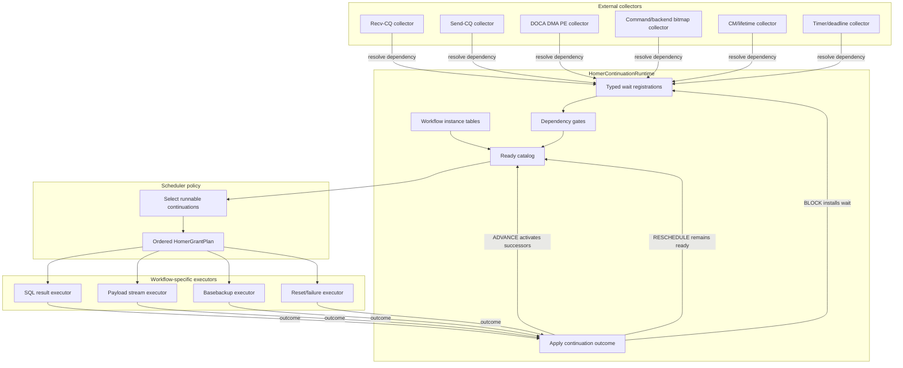
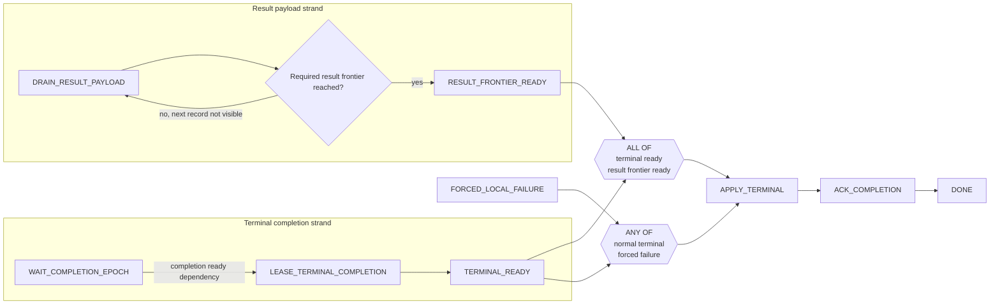
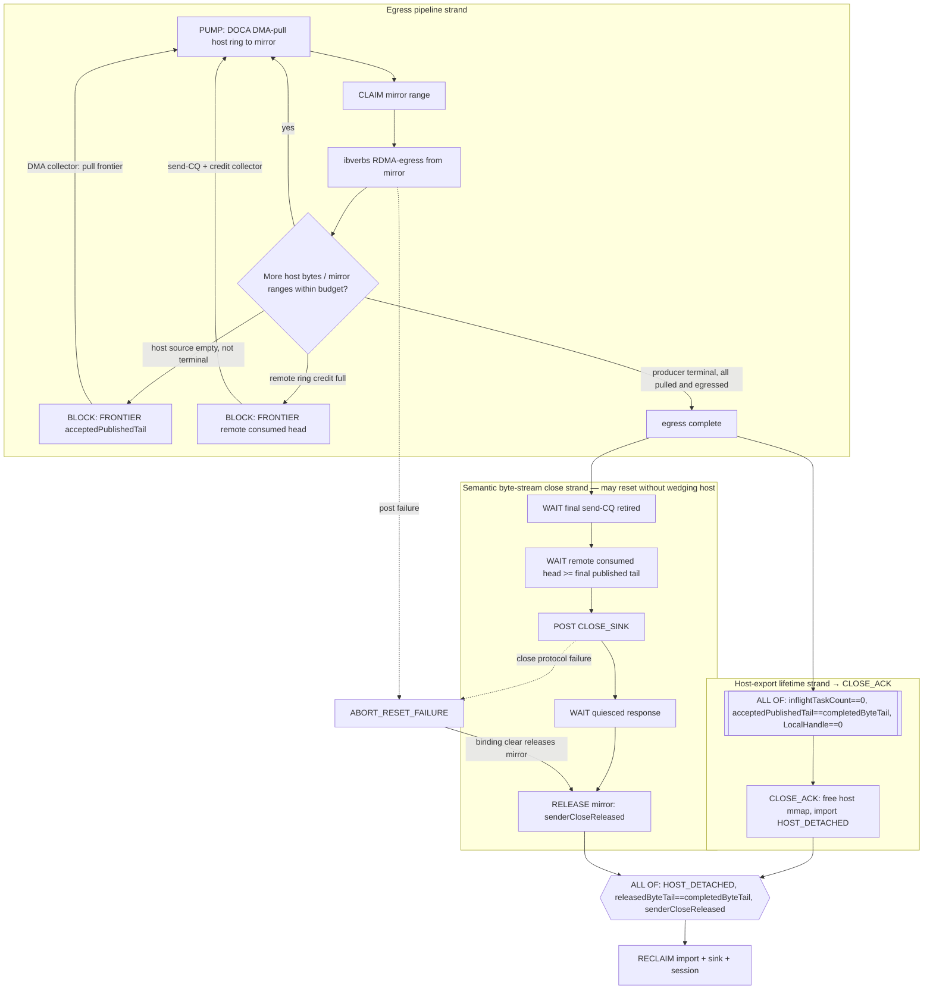
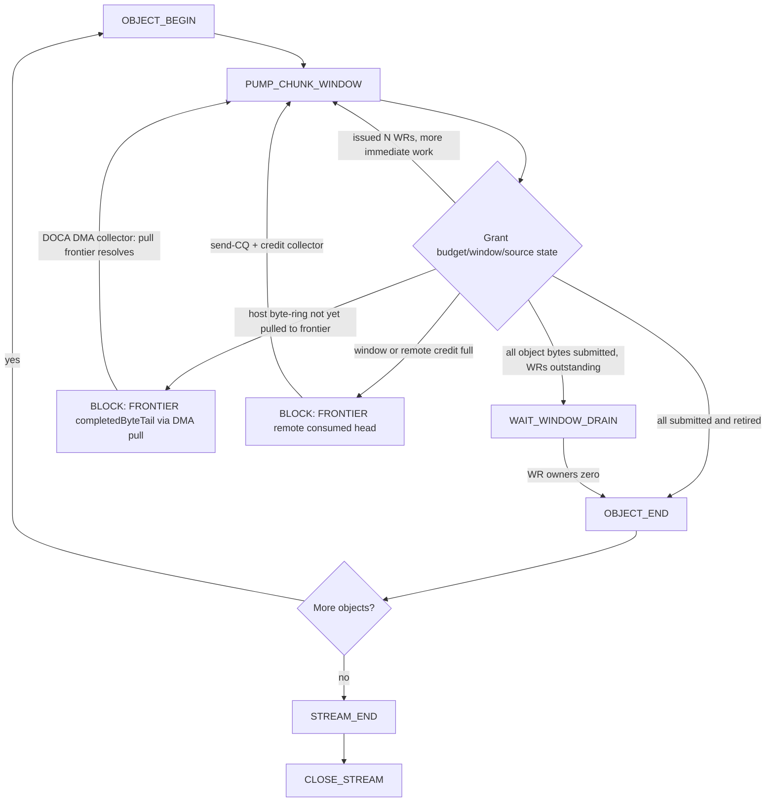
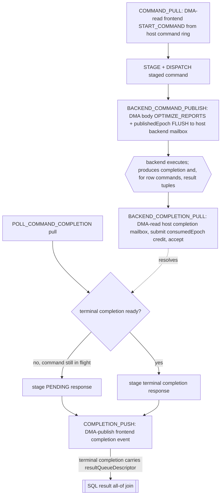

# Homer Continuation Graph Scheduler Plan

## Scope

- **What this doc explains**: the proposed continuation-graph scheduler model for Homer service work after the Slice 4B scheduler-priority hang. It defines the top-level objects, the boundary between workflow logic and scheduling policy, dependency/gate handling, ready-catalog semantics, and a staged migration path from the current guarded-action scheduler.
- **What this doc does not cover**: multi-threaded service execution, a generic workflow DSL, or replacing the RDMA transport ownership fixes already landed in the v27 recovery work.
- **Primary directory**: `docs/kb/future-directions/citus/transport/`
- **Doc type**: `future-direction`

> **Grounding note (updated after the DPU-selected migration).** The original
> version of this plan predates the DPU-offloaded (selected-DPU) transport and
> explicitly excluded DPU offload from scope. That is now stale: the primary
> target is the **DPU-offloaded path** (host backends are CPU producers into
> host memory; the DPU-resident Homer service pulls records with DOCA DMA into a
> DPU-local mirror and RDMA-egresses from that mirror), and the legacy
> host-process/non-DPU path is being removed. The design objects below are
> unchanged in spirit, but the **workflows, resolvers, and lifecycle they must
> model are now the DPU-offloaded ones** — see the new
> [DPU-offloaded grounding](#dpu-offloaded-grounding-current-reality) section,
> the added **DOCA DMA collector** in the external resolvers and runtime-loop
> mermaid, and the rewritten payload-send/close and basebackup workflows. The
> mermaid diagrams are illustrative of the design evolution, not exhaustive
> contracts; where they conflict with the current code, the code (and the
> grounding section's file references) win.

This plan complements [`homer_completion_publication_v27_recovery_plan.md`](homer_completion_publication_v27_recovery_plan.md). The v27 recovery work fixed publication, CQ ownership, reset, close, and failure-lifetime contracts. This plan addresses the remaining scheduler modeling issue: the current machine/action-mask scheduler can expose several semantically dependent action bits and then asks a global planner to infer the safe order.

## Motivation

The Slice 4B hang showed the failure mode directly:

```text
machine exposes PAYLOAD_PROGRESS and PAYLOAD_CLOSE_RECLAIM
scheduler bands prioritize or exclude based on action bits
close/reclaim can be selected before payload progress it depends on
terminal completion remains blocked on result payload
frontend waits indefinitely
```

The design error is not that Homer uses state machines. The error is that one state-machine owner can expose multiple ready actions whose causal relationship is implicit and policy-dependent.

The new rule is:

```text
Workflow owns causal sequencing.
Scheduler owns resource allocation and grant order among already-runnable continuations.
```

A workflow may have several active strands. Each strand has one current continuation. Multiple continuations may be active concurrently when they are genuinely independent or pipelined. A downstream continuation becomes ready through explicit dependency resolution or a gate, not because the scheduler guessed a priority ordering.

The DPU migration produced a second, sharper instance of the same failure class —
the selected-DPU basebackup **close hang** (see checkpoint Stage 10.0). Its root
cause is exactly what this plan targets: the close/reclaim step depended on a
readiness fact (`sendSourceDrained`, derived from the DPU-mirror byte-ring
frontier) that a *different* action (the background import full-free) destroyed
before the close ran. The current mask scheduler had no way to say "the close
continuation depends on the mirror frontier still existing," so it silently
classified the close `CLOSE_OR_RECLAIM_BLOCKED`, never granted it, and the stream
leaked. In the continuation model this is a typed `FRONTIER` / owner-lifetime
dependency the reclaim continuation could not have severed while a waiter existed
— the ordering would have been explicit, not inferred. This example, and the
DPU-offloaded lifecycle it lives in, are described in the grounding section next.

## DPU-offloaded grounding (current reality)

The workflows this plan must model are now the **DPU-offloaded** ones. The legacy
host-process producer/consumer path still exists in the code but is being
removed; do not design around it. Concretely, for a selected-DPU byte-ring
payload/basebackup stream the data and control lifecycle is:

```text
host backend (CPU producer)  --writes-->  host byte ring (exported via DOCA mmap)
DPU Homer service            --DOCA DMA pull-->  DPU-local mirror buffer
DPU Homer service            --ibverbs RDMA write from mirror-->  peer receiver ring
DPU Homer service            --DOCA DMA write-->  host consumed-head credit (frontier)
```

Two facts change the scheduler model versus the pre-DPU design:

1. **DOCA DMA is a first-class external event source.** The DPU DMA engine
   (`homer_service_dpu_dma.c`) owns a single progress engine (`doca_pe`) with
   per-workload-class contexts. Its task completions (byte-ring pull, backend
   command/response/completion publish, grouped-control discovery, consumed-head
   credit) are the resolvers for a whole family of dependencies that did not
   exist in the SHM design: "host bytes pulled into the mirror to frontier F"
   (`completedByteTail`), "a mirror range is ready for egress",
   "consumed-head credit published". This plan therefore adds a **DOCA DMA
   collector** to the external resolvers and the runtime-loop diagram. Ready-set
   building may read maintained DPU-local facts only; actual DMA submit and
   `doca_pe_progress()` happen inside the granted continuation, preserving the
   nonblocking-drain invariant.

2. **The payload close is two lifetimes, not one.** The selected-DPU close
   separates a **host-export lifetime** (local, resource/owner only) from the
   **semantic byte-stream close** (peer-dependent). They must be independent
   strands with independent gates:
   - *Host-export lifetime* → `CLOSE_ACK`: satisfied by local drain only —
     in-flight DMA retired (`inflightTaskCount==0`) and all discovered host bytes
     pulled (`acceptedPublishedTail==completedByteTail`) and local handles
     released (`LocalHandleCount==0`). At `CLOSE_ACK` the host mmap is freed and
     the import moves to `HOST_DETACHED`; the DPU-local mirror survives for
     background egress. This is a `FRONTIER` + `OWNER_COUNT_ZERO` +
     `LOCAL_HANDLE_ZERO` all-of gate. It must never wait on peer/egress/credit.
   - *Semantic byte-stream close* → `CLOSE_SINK` round-trip + final receiver
     credit (`senderVisibleRemoteConsumedHead >= finalPublishedTail`) + local
     send-CQ retirement. This runs in the background and may reset without wedging
     the host-visible close. Its terminal step releases the DPU-local mirror
     (`senderCloseReleased`), which is the dependency that finally lets the
     background import full-free run.

   The Stage 10.0 bug was precisely the inversion of that dependency: the import
   full-free (which should be the *last* consumer of the mirror frontier) ran
   *before* the semantic close consumed it. In the continuation graph, the
   full-free continuation has an explicit owner-lifetime dependency on the
   semantic-close continuation having released the mirror; it cannot be granted
   earlier.

Mapping the current close/reclaim readiness inputs to the typed dependency kinds
(`HomerDependencyKind`, defined later) grounds the abstract model on real code:

| Current-code readiness input | Dependency kind | Owner |
|---|---|---|
| `completedByteTail >= F` (pull complete) | `FRONTIER` | DPU-mirror byte-ring frontier |
| `releasedByteTail == completedByteTail` (egress drained) | `FRONTIER` | mirror frontier |
| `inflightTaskCount == 0` | `OWNER_COUNT_ZERO` | DMA import task owners |
| `payloadSendOwnerCount == 0` / send WRs retired | `OWNER_COUNT_ZERO` | payload send owners |
| `LocalHandleCount == 0` | `LOCAL_HANDLE_ZERO` | sink local handles |
| `senderVisibleRemoteConsumedHead >= finalPublishedTail` | `FRONTIER` | remote consumed-head credit |
| `CLOSE_SINK` async op terminal | `CONTROL_OP` | peer control op |
| `senderCloseReleased` (mirror released to reclaim) | `OWNER_COUNT_ZERO` / owner-lifetime | import ↔ owning stream |
| peer connection state | `CONNECTION_STATE` | CM/peer connection |

## Top-level objects

| Object | Responsibility |
|---|---|
| `HomerWorkflowDefinition` | Immutable, statically declared continuation graph for one workload kind. |
| `HomerWorkflowInstance` | Dynamic state for one command/result/backup/stream execution. Existing state-machine fields move here as domain state. |
| `HomerContinuationDefinition` | One static node in the workflow graph and its action implementation identity. |
| `HomerContinuationInstance` | Runtime state of one node in one workflow instance. |
| `HomerDependencySpec` | One parameterized condition that can block a continuation. |
| `HomerDependencyGate` | Composition of dependencies, such as all-of and any-of joins. |
| `HomerContinuationRuntime` | Service-embedded subsystem that owns continuation state transitions, ready-catalog membership, wait registration, gate satisfaction, grant claiming, and outcome application. |
| `HomerReadyCatalog` | Durable set of runnable continuation references. It is not the ordered grant list. |
| `HomerSchedulerPolicy` | Policy that selects an ordered grant list from the ready catalog under budgets and priorities. |
| `HomerGrantPlan` | Ephemeral ordered list selected for one service pass or scheduling decision. |

## What is the runtime?

`HomerContinuationRuntime` is not a new thread and not the whole service loop. It is a conceptual and code-level subsystem embedded in the Homer service state.

It owns:

```text
workflow registry / fixed workflow instance tables
continuation state transitions
ready catalog insertion/removal
claiming selected grants
rollback of unexecuted grants
wait registration helpers
gate satisfaction helpers
outcome application
stale generation validation
```

The service loop calls into it:

```text
collect external events
    -> dependency resolvers update runtime/gates/ready catalog
scheduler policy builds grant plan from ready catalog
    -> runtime claims grants
executor dispatches grants to workflow-specific code
    -> workflow executor returns outcome
runtime applies outcome
```

Workflow-specific code executes semantic work and updates domain state. It does not directly mutate ready-catalog membership.

## Static workflow definition

The implementation should be fixed C structures, enums, and switch dispatch. Do not build a heap-allocated generic workflow engine or DSL.

```c
typedef uint16_t HomerContinuationNodeId;
typedef uint16_t HomerDependencyGateId;

typedef enum HomerWorkflowKind
{
    HOMER_WORKFLOW_FRONTEND_COMMAND = 1,
    HOMER_WORKFLOW_BACKEND_COMMAND,
    HOMER_WORKFLOW_SQL_RESULT,
    HOMER_WORKFLOW_BASEBACKUP_STREAM,
    HOMER_WORKFLOW_PAYLOAD_STREAM,
    HOMER_WORKFLOW_PAYLOAD_CLOSE,
    HOMER_WORKFLOW_CONNECTION_RESET
} HomerWorkflowKind;

typedef struct HomerContinuationDefinition
{
    HomerContinuationNodeId nodeId;
    uint16_t strandId;

    HomerContinuationKind continuationKind;
    HomerSchedulingClass defaultSchedulingClass;

    /* Static switch-dispatched implementation identity. */
    HomerActionKind actionKind;

    const HomerContinuationNodeId *successors;
    uint16_t successorCount;

    HomerDependencyGateId completionGate;
} HomerContinuationDefinition;

typedef struct HomerWorkflowDefinition
{
    HomerWorkflowKind kind;

    const HomerContinuationDefinition *nodes;
    uint16_t nodeCount;

    const HomerDependencyGateDefinition *gates;
    uint16_t gateCount;

    uint16_t maxActiveStrands;
} HomerWorkflowDefinition;
```

Examples:

```c
extern const HomerWorkflowDefinition HomerSqlResultWorkflowDefinition;
extern const HomerWorkflowDefinition HomerPayloadStreamWorkflowDefinition;
extern const HomerWorkflowDefinition HomerBaseBackupWorkflowDefinition;
```

## Dynamic workflow instance

```c
typedef struct HomerWorkflowRef
{
    HomerWorkflowKind kind;
    uint32_t index;
    uint64_t generation;
} HomerWorkflowRef;

typedef struct HomerContinuationRef
{
    HomerWorkflowRef workflow;
    HomerContinuationNodeId nodeId;
    uint64_t activationGeneration;
} HomerContinuationRef;

typedef enum HomerContinuationState
{
    HOMER_CONTINUATION_DORMANT = 0,
    HOMER_CONTINUATION_READY,
    HOMER_CONTINUATION_CLAIMED,
    HOMER_CONTINUATION_RUNNING,
    HOMER_CONTINUATION_WAITING,
    HOMER_CONTINUATION_DONE,
    HOMER_CONTINUATION_CANCELLED
} HomerContinuationState;

typedef struct HomerContinuationInstance
{
    HomerContinuationRef ref;
    HomerContinuationState state;

    HomerSchedulingClass schedulingClass;

    HomerWaitRegistration waitRegistration;

    uint64_t readySinceServicePass;
    uint64_t lastGrantedServicePass;

    bool readyCatalogMember;
} HomerContinuationInstance;

typedef struct HomerWorkflowInstance
{
    const HomerWorkflowDefinition *definition;
    HomerWorkflowRef ref;

    HomerWorkflowState state;

    HomerContinuationInstance continuations[
        HOMER_MAX_CONTINUATIONS_PER_WORKFLOW];

    HomerDependencyGateInstance gates[
        HOMER_MAX_GATES_PER_WORKFLOW];

    union
    {
        HomerSqlResultWorkflowState sqlResult;
        HomerBaseBackupWorkflowState baseBackup;
        HomerPayloadWorkflowState payload;
        HomerCommandWorkflowState command;
    } data;
} HomerWorkflowInstance;
```

## Active frontier

A workflow frontier contains zero or more active continuations.

```text
for each sequential strand:
    at most one active continuation

for one workflow:
    several strands may be active concurrently
```

Examples:

```text
SQL result workflow:
    WAIT_TERMINAL_EVENT strand
    DRAIN_RESULT_PAYLOAD strand
    all-of join to APPLY_TERMINAL

Basebackup workflow:
    PUMP_CHUNK_WINDOW continuation (DMA-pull host ring -> mirror -> RDMA egress)
    physical WR owners and borrowed mirror ranges are not scheduler continuations

Payload stream workflow (DPU-offloaded, two close strands joined by a reclaim gate):
    egress strand:        DMA_PULL -> CLAIM_MIRROR -> RDMA_EGRESS (looped)
    host-export strand:   WAIT(local drain all-of) -> CLOSE_ACK (free host mmap)
    semantic-close strand: WAIT_SEND_RETIRED -> WAIT_REMOTE_DRAIN -> CLOSE_SINK -> RELEASE_MIRROR
    reclaim gate:         all-of(HOST_DETACHED, egress drained, senderCloseReleased) -> RECLAIM
```

## Mermaid: high-level runtime/scheduler loop



## Grant execution and outcome application

A scheduler grant is selected from the ready catalog and then claimed.

```c
typedef struct HomerContinuationBudget
{
    uint32_t maxRecords;
    uint64_t maxBytes;
    uint32_t maxWrs;
    uint32_t maxCqPollBatches;
} HomerContinuationBudget;

typedef struct HomerContinuationGrant
{
    HomerContinuationRef continuation;
    HomerContinuationBudget budget;
    HomerSchedulingClass schedulingClass;
    uint64_t schedulerDecisionEpoch;
} HomerContinuationGrant;
```

The grant dispatcher resolves the workflow and calls a static executor:

```c
static HomerContinuationOutcome
HomerExecuteContinuationGrant(
    HomerContinuationRuntime *runtime,
    const HomerContinuationGrant *grant)
{
    HomerWorkflowInstance *workflow;
    HomerContinuationInstance *continuation;

    workflow = HomerResolveWorkflow(runtime, grant->continuation.workflow);
    continuation = HomerResolveContinuation(workflow, grant->continuation);

    if (continuation == NULL ||
        continuation->state != HOMER_CONTINUATION_CLAIMED)
    {
        return HomerStaleContinuationOutcome();
    }

    continuation->state = HOMER_CONTINUATION_RUNNING;

    switch (workflow->definition->kind)
    {
        case HOMER_WORKFLOW_SQL_RESULT:
            return HomerExecuteSqlResultContinuation(
                workflow, continuation, &grant->budget);

        case HOMER_WORKFLOW_BASEBACKUP_STREAM:
            return HomerExecuteBaseBackupContinuation(
                workflow, continuation, &grant->budget);

        case HOMER_WORKFLOW_PAYLOAD_STREAM:
        case HOMER_WORKFLOW_PAYLOAD_CLOSE:
            return HomerExecutePayloadContinuation(
                workflow, continuation, &grant->budget);

        case HOMER_WORKFLOW_CONNECTION_RESET:
            return HomerExecuteResetContinuation(
                workflow, continuation, &grant->budget);

        default:
            return HomerInvalidContinuationOutcome();
    }
}
```

The runtime applies the returned outcome:

```c
HomerApplyContinuationOutcome(runtime, grant->continuation, &outcome);
```

## Continuation outcome

```c
typedef enum HomerContinuationDisposition
{
    HOMER_CONTINUATION_ADVANCE = 0,
    HOMER_CONTINUATION_BLOCK,
    HOMER_CONTINUATION_RESCHEDULE,
    HOMER_CONTINUATION_COMPLETE,
    HOMER_CONTINUATION_FAIL
} HomerContinuationDisposition;

typedef struct HomerContinuationProgress
{
    uint32_t recordsProcessed;
    uint64_t bytesProcessed;
    uint32_t wrsPosted;
    uint32_t cqesProcessed;
} HomerContinuationProgress;

typedef struct HomerContinuationOutcome
{
    HomerContinuationDisposition disposition;
    HomerContinuationProgress progress;

    union
    {
        struct
        {
            HomerTransitionCode transitionCode;
        } advance;

        struct
        {
            HomerDependencySpec dependency;
        } block;

        struct
        {
            HomerWorkflowFailureCode failureCode;
        } fail;
    } data;
} HomerContinuationOutcome;
```

Semantics:

```text
ADVANCE:
    current step completed; activate successors or satisfy joins.

BLOCK:
    current continuation remains active but becomes WAITING on a typed dependency.

RESCHEDULE:
    continuation made useful progress and remains immediately runnable.

COMPLETE:
    strand or workflow finished.

FAIL:
    transition to typed failure/reset continuation and cancel incompatible siblings.
```

`RESCHEDULE` must report useful progress:

```c
Assert(outcome.progress.recordsProcessed > 0 ||
       outcome.progress.bytesProcessed > 0 ||
       outcome.progress.wrsPosted > 0 ||
       outcome.progress.cqesProcessed > 0);
```

If no useful progress occurred, the continuation must return `BLOCK` with an explicit dependency.

## Ready catalog versus grant list

The current ordered grant list remains useful. It is the scheduler's output for one service pass.

A new ready catalog is durable across service passes. It records which continuation instances are runnable. It should have set semantics, not necessarily FIFO semantics.

```c
typedef struct HomerReadyMetadata
{
    bool present;
    HomerSchedulingClass schedulingClass;
    uint64_t readySinceServicePass;
    uint64_t lastGrantedServicePass;
    uint32_t estimatedCost;
} HomerReadyMetadata;

typedef struct HomerReadyCatalog
{
    uint64_t readyBits[HOMER_SCHEDULING_CLASS_COUNT]
                      [HOMER_CONTINUATION_WORD_COUNT];

    HomerReadyMetadata metadata[HOMER_MAX_CONTINUATIONS];
} HomerReadyCatalog;
```

The scheduler policy can implement FIFO, round-robin, age, deficit, or priority. The continuation runtime should not hardcode those policies.

When a grant is selected:

```text
READY -> CLAIMED
remove from ready catalog
```

If plan execution aborts before the grant runs, the runtime must restore unexecuted claimed grants:

```c
void HomerAbortUnexecutedGrantPlan(
    HomerContinuationRuntime *runtime,
    HomerGrantPlan *plan,
    uint16_t firstUnexecutedGrant);
```

## Dependency condition versus wait registration

A dependency condition describes what must become true.

```c
typedef enum HomerDependencyKind
{
    HOMER_DEPENDENCY_NONE = 0,
    HOMER_DEPENDENCY_EVENT_EPOCH,
    HOMER_DEPENDENCY_FRONTIER,
    HOMER_DEPENDENCY_OWNER_COUNT_ZERO,
    HOMER_DEPENDENCY_RESOURCE_CREDIT,
    HOMER_DEPENDENCY_CONTROL_OP,
    HOMER_DEPENDENCY_CONNECTION_STATE,
    HOMER_DEPENDENCY_LOCAL_HANDLE_ZERO,
    HOMER_DEPENDENCY_DEADLINE,
    HOMER_DEPENDENCY_GATE
} HomerDependencyKind;

typedef struct HomerDependencyOwnerRef
{
    HomerDependencyOwnerKind kind;
    uint32_t index;
    uint64_t generation;
} HomerDependencyOwnerRef;

typedef struct HomerDependencySpec
{
    HomerDependencyKind kind;
    HomerDependencyOwnerRef owner;

    union
    {
        struct { uint64_t requiredEpoch; } eventEpoch;
        struct { uint64_t requiredFrontier; } frontier;
        struct { uint32_t requiredCount; } count;
        struct { uint32_t minimumCredit; } credit;
        struct { uint32_t opIndex; uint32_t opGeneration; } controlOp;
        struct { uint64_t deadlineServicePass; } deadline;
        struct { HomerDependencyGateId gateId; uint64_t gateGeneration; } gate;
    } condition;
} HomerDependencySpec;
```

A wait registration identifies the continuation that should become ready when the dependency is satisfied.

```c
typedef struct HomerWaitRegistration
{
    bool active;
    HomerContinuationRef continuation;
    HomerDependencySpec dependency;
    uint64_t registrationGeneration;
} HomerWaitRegistration;
```

## Gates for multiple dependencies

Do not place arbitrary vectors of conditions in each wait ticket. Use one condition per wait registration and compose conditions with gates.

```c
typedef enum HomerDependencyGateMode
{
    HOMER_DEPENDENCY_GATE_ALL = 1,
    HOMER_DEPENDENCY_GATE_ANY = 2
} HomerDependencyGateMode;

typedef struct HomerDependencyGateInstance
{
    HomerDependencyGateMode mode;
    uint64_t requiredMask;
    uint64_t satisfiedMask;
    uint64_t gateGeneration;
    HomerContinuationRef target;
} HomerDependencyGateInstance;
```

### Known all-of gate use cases

1. **Frontend SQL terminal apply**

   ```text
   terminal completion available
   AND required result frontier drained
       -> apply terminal completion
   ```

2. **Descriptor-backed completion publication**

   ```text
   descriptor version visible or cached
   AND hot completion slot validated
       -> CPU publish frontend completion ready
   ```

3. **Payload graceful close / normal reclaim**

   ```text
   final payload/EOS posted
   AND all local payload WRs through final tail retired
   AND remote final consumed head observed
   AND quiesced close response posted
   AND final head ACK owner retired
   AND no ready/executor/local-handle references remain
       -> reclaim stream binding
   ```

4. **Basebackup object or stream drain**

   ```text
   all object bytes submitted
   AND outstanding WR window is zero
       -> object end / next object / stream end
   ```

5. **Connection reset completion**

   ```text
   reset-begin snapshot captured
   AND QP/CQ teardown complete
   AND transport-private owners abort-cleared
   AND service-owned payload/ACK owners reconciled
   AND terminal failure published or abort disposition recorded
       -> clear bindings / reclaim affected streams
   ```

6. **Payload failure cleanup**

   ```text
   terminal FAILED status published
   AND object-family failure delivery committed or durably staged
   AND peer binding cleared or reset cutoff proved
   AND local handle/lifetime conditions satisfied
       -> reclaim local payload state
   ```

### Known any-of gate use cases

1. **SQL command terminal winner**

   ```text
   normal peer terminal completion
   OR forced local transport failure completion
       -> terminal event selected
   ```

   The losing terminal path must be suppressed after exact sequence validation.

2. **Result drain terminal condition**

   ```text
   required result frontier reached
   OR terminal FAILED status observed
       -> result drain strand completes as success or failure
   ```

3. **Payload stream terminal path**

   ```text
   normal quiesced close
   OR abort/reset failure
       -> stream lifetime exits normal data path
   ```

4. **Basebackup read wait**

   ```text
   next object/chunk record available
   OR OBJECT_ERROR / ERROR+EOS
   OR local terminal FAILED status
       -> basebackup reader wakes and handles outcome
   ```

5. **Control operation**

   ```text
   response received
   OR connection reset/failure
   OR retry/deadline failure
       -> async op leaves WAIT_RESPONSE
   ```

6. **Credit/resource wait**

   ```text
   source/SQ/owner credit becomes available
   OR connection reset/failure
       -> waiting continuation either retries or fails
   ```

7. **Close retry**

   ```text
   peer progress observed
   OR retry deadline expires
       -> retry close request
   ```

## Dependency resolution model

There should be a common logical protocol:

```text
register dependency
resolve dependency
make continuation ready
```

But there should not be one global dynamically searched observer list.

Use specialized storage at each dependency owner:

```text
payload frontier owner:
    usually one required-frontier waiter

send-CQ owner:
    owner entry knows the stream/session and frontier

control op:
    async op owner tag knows the waiting workflow/continuation

local handle lifetime:
    handle control stores one waiter

timer/deadline:
    small shared heap or timing wheel
```

Resolvers call a thin generic helper once they have found the specific wait registration:

```c
void HomerDependencyResolve(
    HomerContinuationRuntime *runtime,
    HomerWaitRegistration *registration);
```

### External resolvers

```text
recv-CQ collector: command, completion, payload, control arrival
send-CQ collector: WR/source retirement and credit release
DOCA DMA PE collector: byte-ring pull frontier reached (completedByteTail),
    mirror range ready for egress, backend command/response/completion publish
    retired, grouped-control discovery, consumed-head credit published,
    import teardown drained / host-detached reclaim
shared bitmap collector: frontend command/backend completion availability
CM collector: connection state
timer collector: deadline
```

The DOCA DMA PE collector is the DPU-offloaded addition. It drains the single
shared `doca_pe` inside the granted DMA continuation (never speculatively during
ready-set building) and resolves the byte-ring/frontier/owner dependencies listed
in the [grounding section](#dpu-offloaded-grounding-current-reality). It is the
resolver whose racing full-free broke the Stage 10.0 close: the reclaim
continuation must depend on the semantic-close continuation's mirror release, so
the collector cannot retire the import frontier while a close waiter still reads
it.

### Internal resolvers

```text
payload action reaches final frontier
completion publication succeeds
control response post succeeds
local handle detaches
connection reset completes
failure delivery commits
chunk pump submits the final object byte
```

External collectors are dependency resolvers, but not all resolvers are external collectors.

## Register-and-recheck

For dependencies whose state can change concurrently with wait installation, use register-and-recheck to avoid lost wakeups.

```c
static bool
HomerContinuationWaitForFrontier(
    HomerContinuationRuntime *runtime,
    HomerContinuationInstance *continuation,
    HomerFrontierOwner *owner,
    uint64_t requiredFrontier)
{
    if (HomerAcquireLoadFrontier(owner) >= requiredFrontier)
        return false;

    HomerInstallFrontierWaiter(
        owner,
        continuation->ref,
        requiredFrontier);

    HomerAcquireFence();

    if (HomerAcquireLoadFrontier(owner) >= requiredFrontier)
    {
        HomerResolveInstalledFrontierWaiter(owner);
        return false;
    }

    return true;
}
```

For purely service-local state updated only by the single service thread, registration and resolution are serialized and the second atomic check is unnecessary.

## Mermaid: SQL result workflow



Under selected-DPU, the resolvers feeding this workflow are DMA-backed: the
terminal-completion epoch (`T0`) is satisfied by the DOCA DMA collector retiring
the backend-completion publish, and the result-payload strand's required frontier
(`R1`) is the same DMA-pull-into-mirror + RDMA-egress pipeline as the payload
workflow (the mirror byte-ring frontier is the `FRONTIER` owner). The join and
close/reclaim structure are unchanged; only the resolver sources move to the DMA
collector.

## Mermaid: payload send/close workflow (DPU-offloaded)

This is the grounded, DPU-offloaded shape. The single pre-DPU `PUMP_PAYLOAD ->
POST_FINAL -> ... -> RECLAIM` chain is replaced by (a) a DMA-pull + mirror-egress
pipeline and (b) **two independent close strands** joined by an all-of reclaim
gate — the host-export lifetime and the semantic byte-stream close. The
host-export strand must never depend on the semantic strand (that coupling was
the design smell behind the Stage 10.0 hang).



Notes grounding this on the code:

- The egress pipeline is `HomerServicePumpOutgoingDpuMirrorByteRingPayload()` plus
  the DMA engine's byte-ring pull; the mirror claim/release lifetime is
  `HomerDpuDmaClaim/Release/UnclaimMirroredByteRange()`.
- The host-export strand is `HomerServiceDpuPayloadStreamsDrainedForClosingSetup()`
  (lifetime-only) → `HomerDpuDmaDetachHostMmapForClose()`. It is a pure all-of gate
  over local owners; **no semantic edge feeds into it**.
- The semantic strand is `TupleSinkServicePeerCloseSinkBestEffort()`; its terminal
  `RELEASE mirror` is `HomerServiceClearPayloadStreamPeerBinding()` calling
  `HomerDpuDmaMarkImportSenderCloseReleased()`.
- The reclaim all-of gate is `HomerDpuDmaReclaimDetachedImports()`; its
  `senderCloseReleased` term is the explicit owner-lifetime dependency that the
  Stage 10.0 fix added so the full-free cannot precede the semantic close.

## Mermaid: basebackup bounded chunk window



For the DPU-offloaded basebackup, `PUMP_CHUNK_WINDOW` is one continuation that,
per grant, DOCA DMA-pulls host byte-ring bytes into the DPU-local mirror and
issues N ibverbs RDMA WRs from the claimed mirror range. The N WR owner records
and the borrowed mirror range are physical lifetime records, not scheduler
continuations; the mirror prefix is released on send-CQ retirement
(`HomerDpuDmaReleaseMirroredByteRangePrefix()`). Its stream close reuses the same
two-strand host-export / semantic-close shape as the payload workflow above.

Separate child continuations are justified only if chunks have independent semantic work, such as compression, independent disk reads, separate remote targets, independent retry policy, or multiple worker threads.

## Mermaid: command/completion workflow (DPU-offloaded)

This workflow did not exist in the pre-DPU plan; under selected-DPU it is the
DOCA DMA command lifecycle that drives the pgbench transaction. All legs are DOCA
DMA between host memory and the DPU (no RDMA — commands/completions are a *local*
host↔DPU exchange). The controlling invariant is **one command in flight per
selected-DPU session** (`HomerServiceDpuSelectedSessionState.inFlightCommandKind`):
a new `START_COMMAND` is refused while a command is in flight or a terminal
completion is unconsumed.



Ground truth: the scheduler actions are `HOMER_PROGRESS_ACTION_DPU_COMMAND_PULL`,
`..._STAGED_COMMAND_DISPATCH`/`_EXECUTE`, `..._BACKEND_COMMAND_STAGE`/`_PUBLISH`,
`..._BACKEND_COMPLETION_PULL`, `..._COMPLETION_PUSH`, plus `..._CONSUMED_HEAD_PUBLISH`
for credit; acceptance is `HomerServiceDpuAcceptOneBackendCompletion()` and the
poll response is `HomerServiceDpuStageOnePollCompletionResponse()`. Completion
acceptance is gated on the consumed-epoch DMA *submit* (not its later PE callback),
and the frontend poll slot is never parked — a not-ready poll returns PENDING and
the frontend re-polls.

## SQL transaction workflow: two strands, one all-of join (grounded)

A row-producing SQL command (pgbench `SELECT abalance`) is one **SQL session**
workflow instance (long-lived domain state) whose per-command execution is two
continuation strands meeting at an all-of gate. The schedulable unit is the
**action** (a continuation node's executor, run by the runtime on a grant); the
"command" is not itself a unit — it is this set of continuation nodes re-activated
per command (bumping `activationGeneration`). This is the same all-of join the
pre-DPU [SQL result workflow](#mermaid-sql-result-workflow) already draws; the
grounding below is what each node actually is.

Continuation nodes (each node's `actionKind` names the executor the runtime runs):

```text
command/completion strand:
    COMMAND_PULL             DPU_COMMAND_PULL            (resolve: DMA collector, START_COMMAND staged)
    STAGE_DISPATCH           DPU_STAGED_COMMAND_DISPATCH
    BACKEND_COMMAND_PUBLISH  DPU_BACKEND_COMMAND_PUBLISH  -> WAIT_BACKEND
    WAIT_BACKEND             BLOCK: EVENT_EPOCH (backend completion staged)
    BACKEND_COMPLETION_PULL  DPU_BACKEND_COMPLETION_PULL (+ DPU_CONSUMED_HEAD_PUBLISH credit)
    COMPLETION_PUSH          DPU_COMPLETION_PUSH          == terminal-completion continuation

result strand (active only when the command produces rows):
    RESULT_DRAIN             byte-ring-pull actionKind    (same executor as payload egress)
    RESULT_FRONTIER_READY    BLOCK: FRONTIER (result byte-ring frontier)

gate + apply:
    G = ALL_OF(terminal-completion, result-frontier)      (HomerDependencyGate, all-of)
    APPLY_TERMINAL           bind sink from completion.resultQueueDescriptor, borrow/read/release tuple
    DONE

session serialization (a dependency the session owns, not a scheduler band):
    the next command's COMMAND_PULL BLOCKs until the prior command's DONE
    (one command in flight; HomerServiceDpuSelectedSessionState.inFlightCommandKind)
```

Resolve points (which collector makes each BLOCKed continuation ready — the part
worth getting exactly right):

- `WAIT_BACKEND`: the DOCA DMA collector at the backend-completion pull's
  *acceptance*, which is the consumed-epoch DMA **submit**, not its later PE
  callback. The runtime must treat the submit as the resolve edge (repeated
  observation of the same staged completion before the credit retires is a
  duplicate, not a new event).
- `RESULT_FRONTIER_READY`: the DOCA DMA collector at the result byte-ring pull
  frontier (a `FRONTIER` owner). Same executor / `actionKind` as any payload
  byte-ring drain — different owner.
- `G`'s terminal arm is satisfied by `COMPLETION_PUSH` retiring, but the gate
  carries the completion **descriptor** as its satisfaction payload (not a
  boolean), because `APPLY_TERMINAL` needs `resultQueueDescriptor` as the binding
  key.

Why one instance, not two: `APPLY_TERMINAL` reads shared domain state produced by
the completion strand (the result binding) to interpret the result strand's
frontier. Keeping both strands' nodes in one session workflow instance lets the
gate resolve against local domain state instead of validating a second instance's
generation. Promote the result strand to its own workflow + a cross-workflow gate
only if a result egress becomes genuinely independent (cross-host result to a
different node, independent retry) — the documented escape hatch, not the default.

Concurrency, not sequence: the backend produces result tuples into the byte ring
*while it executes*, before it writes the terminal completion, and the DPU pulls
that ring in parallel. So the two strands run concurrently and meet at the gate; a
linear "complete then drain" chain would be wrong. The only asymmetry is in the
data — the completion supplies the binding key, the result strand supplies the
data, and `APPLY_TERMINAL` needs both.

Evidence this is real and separable: Stage 8B.15 failed because the
command/completion strand ran selected-DPU while the result-sink strand still
opened the legacy host-service control region (`RemoteExecOpenServiceOwnedResultSink()`);
Stage 8B.16 fixed it by carrying result metadata on the completion and binding a
lifecycle-created result byte ring — i.e. by wiring the join. A pure DML/scalar
command (`UPDATE`/`INSERT`) has no result binding, so the result strand is
inactive and the join degenerates to the completion strand alone — same model,
one strand dormant.

## Current-code migration mapping

| Current object | New role |
|---|---|
| `HomerProgressActionKind` | Initial `HomerActionKind` executor implementation enum. |
| `HomerProgressActionPayload` | Transitional grant payload; later mostly `HomerContinuationRef`. |
| `HomerProgressExecutionPlan` | Remains the ordered `HomerGrantPlan`. |
| `readyActionMask` | Removed for migrated workflows. |
| owned/runnable bits | Become continuation `WAITING`/`READY` membership and/or wait registrations. |
| `blockedReasonMask` | Replaced by typed `HomerDependencySpec` and gate state. |
| exact CQ/control/reset actions | Collectors or system continuations. |
| payload/close state structs | Domain state inside payload workflow instances. |
| send/ACK owner FIFOs | Physical dependency owners and resolvers. |
| shared ready bitmaps | External event discovery, not workflow state. |
| `HomerDpuDmaEngine` single `doca_pe` + per-class contexts | The DOCA DMA PE collector; its task completions are external resolvers. |
| `HomerDpuDmaHostMmapImport` lifecycle (ACTIVE / CLOSING / HOST_DETACHED) | Host-export lifetime owner; drives the `CLOSE_ACK` all-of gate, distinct from the semantic close. |
| byte-ring frontiers (`accepted` / `completed` / `releasedByteTail`) | `FRONTIER` dependency owners for pull / egress / credit. |
| `senderCloseReleased` flag | Owner-lifetime dependency: the import full-free continuation waits on the semantic-close continuation's mirror release. |
| `HomerServicePayloadStreamReasonMasks` `readyMask`/`blockedMask` (incl. `CLOSE_OR_RECLAIM_PENDING`/`_BLOCKED`) | Replaced by typed dependencies + gates. The Stage 10.0 `CLOSE_OR_RECLAIM_BLOCKED` misclassification is exactly the inference this model removes. |
| `CanSubmit` / `CanDrainHostRing` / `CanEgressMirror` import gates | Per-action lifecycle predicates; become scheduling-class + dependency-kind constraints on the DMA continuations. |
| `HomerServiceDpuSelectedSessionState` (`inFlightCommandKind`, staged completion) | Command-workflow domain state; the one-command-in-flight dependency the workflow owns. |
| DPU command/completion actions (`DPU_COMMAND_PULL`, `DPU_BACKEND_COMMAND_STAGE`/`_PUBLISH`, `DPU_BACKEND_COMPLETION_PULL`, `DPU_COMPLETION_PUSH`, `DPU_CONSUMED_HEAD_PUBLISH`) | Command/completion workflow continuations; all DMA-collector-resolved. |
| completion `resultQueueDescriptor` + `BindRemoteExecutionCommandResult()` | The join edge binding the command terminal completion to the result-payload sink (the pgbench transaction interplay). |

## Migration sequence

### Continuation-0 — Freeze this runtime contract

Document the definitions above in the Citus tree comments and the KB. No behavior change.

### Continuation-1 — Runtime scaffolding

Implement:

```text
ContinuationRef
ContinuationState
ReadyCatalog
Grant claim / grant rollback
ContinuationOutcome
ApplyOutcome
basic stale-generation validation
```

Wrap one existing cold action first.

### Continuation-2 — Payload send/close workflow

Migrate the payload/close path first because it directly replaces the bad Slice 4B payload-vs-close priority inference, and because the DPU-offloaded close is the concrete case that already broke twice (Slice 4B, then Stage 10.0).

Initial nodes (DPU-offloaded shape — egress pipeline + two close strands + reclaim gate):

```text
egress strand:         DMA_PULL, CLAIM_MIRROR, RDMA_EGRESS
host-export strand:    WAIT_LOCAL_DRAIN (all-of), CLOSE_ACK
semantic-close strand: WAIT_SEND_RETIRED, WAIT_REMOTE_DRAIN, POST_CLOSE_SINK,
                       WAIT_CLOSE_RESPONSE, RELEASE_MIRROR
reclaim:               RECLAIM (all-of gate: HOST_DETACHED, egress drained, senderCloseReleased)
failure:               FAIL_RESET (routes through RELEASE_MIRROR)
```

The load-bearing new edges versus the pre-DPU list: the host-export strand has
**no** dependency on the semantic strand, and `RECLAIM`'s gate includes the
`senderCloseReleased` owner-lifetime term. Getting those two right is the whole
Stage 10.0 fix expressed declaratively.

### Continuation-3 — SQL result join

Migrate:

```text
terminal completion
+
required result frontier
```

to a two-strand all-of gate.

### Continuation-4 — Command lifecycle

Migrate the DPU-offloaded command/completion workflow: `COMMAND_PULL ->
STAGE/DISPATCH -> BACKEND_COMMAND_PUBLISH -> WAIT_BACKEND -> BACKEND_COMPLETION_PULL
(+ consumed-epoch credit) -> POLL_RESPONSE (PENDING or terminal) -> COMPLETION_PUSH`.
The DOCA DMA collector resolves each step; the per-session `inFlightCommandKind`
enforces one command in flight (a dependency the workflow owns, not a scheduler
band). Do this together with Continuation-3, because for row-producing SQL the
command/completion strand and the SQL-result strand are the two arms of one
all-of join and share the result binding (`resultQueueDescriptor`) — migrating one
without the other reproduces the Stage 8B.15 split-channel failure. Legacy shared
command/completion producer bitmaps become external event discovery for the
non-DPU path only, which is being removed.

### Continuation-5 — Basebackup bounded pump

Create the chunk-window continuation while retaining existing RDMA range batching and WR owner records.

### Continuation-6 — Scheduler policy migration

Scheduler consumes only ready-catalog entries from migrated workflows. Retain the old action-mask planner for unmigrated workflows during transition.

### Continuation-7 — Remove old machine-action inference

Delete migrated uses of:

```text
readyActionMask
close-vs-payload priority guessing
action-band exclusions
broad workflow scans
```

## Invariants

```text
one continuation appears at most once in the ready catalog

CLAIMED continuation appears in exactly one grant

unexecuted claimed grants are restored to READY

WAITING continuation has exactly one direct wait registration
or is target of exactly one active gate

RESCHEDULE reports useful progress

BLOCK installs a dependency

workflow executor never mutates ready catalog directly

resolver validates owner and continuation generation

join target becomes ready at most once per gate generation

payload close is never active before payload predecessor completes

scheduler chooses only among READY continuations

host-export lifetime (CLOSE_ACK / host mmap free) never depends on the semantic
    byte-stream close (CLOSE_SINK, receiver credit); they are separate strands

a frontier/owner a continuation waits on is never retired or freed while a
    waiter still reads it (the reclaim/free continuation cannot outrun its
    consumers) -- this is the Stage 10.0 close-hang invariant made explicit

the DPU-mirror import full-free runs only after the semantic close releases the
    mirror (senderCloseReleased); the host mmap free (CLOSE_ACK) runs earlier on
    local drain only

a selected-DPU session has at most one command in flight; a new START_COMMAND is
    refused while inFlightCommandKind is set or a terminal completion is unconsumed

a row-producing command completes only when BOTH its terminal completion and its
    result-payload frontier are ready (all-of join); the terminal completion is
    the binding key (resultQueueDescriptor) for the result-payload sink
```

## Immediate next step

Before implementing a new Slice 4B scheduler policy, implement Continuation-0 and Continuation-1 as scaffolding. Then migrate only the payload send/close workflow in Continuation-2. This should eliminate the current Slice 4B hang class without rewriting basebackup, SQL completion, or command lifecycle in the same patch.
